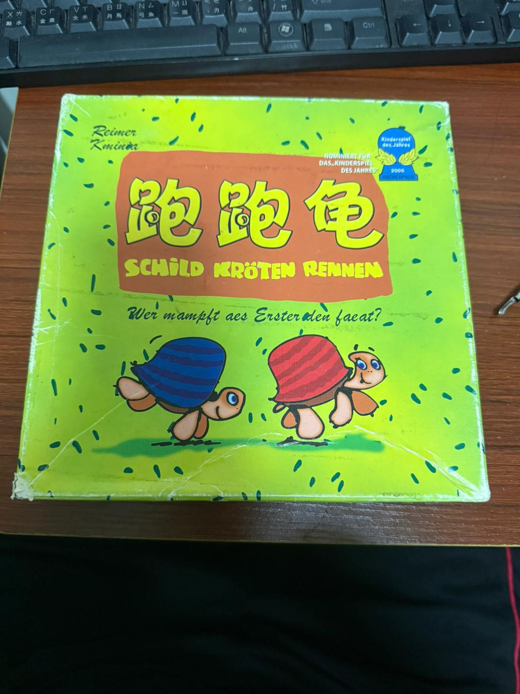
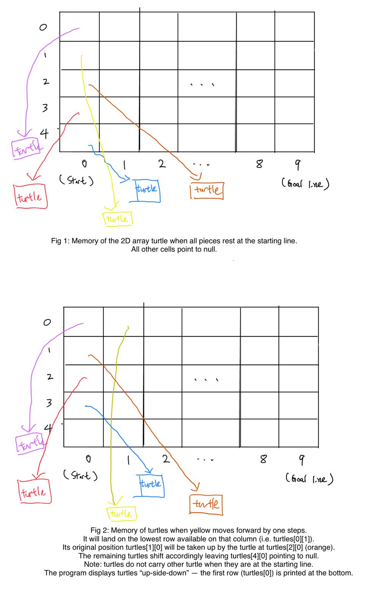

# COMP2046 Programming Assignment 2 - Simplified The Great Turtle Race

## 2025-26 Semester 1

* Designed by: [Dr. Kevin Wang](mailto:kevinw@comp.hkbu.edu.hk)
* Q & A: [Discord](https://discordapp.com/channels/1004554070083776672/1004554070083776678)
* Assignment Website: [GitHub](https://github.com/khwang0/COMP2046-2526PA2)
* Due: 
  * UAT Due: 23:59pm 29/10/2025 (Wednesday midnight)
  * Programming Due: 23:59pm 8/11/2025 (Saturday midnight)
* Download the demo program: [here](demo.jar)
* Download everything from the assignment: [here](https://github.com/khwang0/COMP2046-2526PA2/archive/refs/heads/master.zip)

> To run the demo program, type the following in your terminal:
> 
> ```sh
> java -jar demo.jar
> ```
> or if you want to run the program with 3 players
> ```sh
> java -jar demo.jar 3
> ```
>





# Learning outcome

Students are expected to have some practice on basic OO programming and concepts of references. We expect most students would spend eight hours or more to finish the assignment without any assistance. Make sure you start earlier as possible and ask us on Discord if you have any difficulty! 

> Again, in this assignment you are not allowed to use any data structure such as ArrayList, Arrays, Vector.

# Introduction

You are going to complete a simplified version of the board game **The Great Turtle Race** (Schild Kröten Rennen, 跑跑龟)! There are four Java files [Gameboard.java](Gameboard.java), [PlayCard.java](PlayCard.java), [Player.java](Player.java), and [Turtle.java](Turtle.java). Complete the methods stated in the skeleton code and you are done. Some of these methods are very straightforward while some of them ain't that easy. Make sure you can follow the instructions given at the top of each method.

A [sample program](demo.jar) is given to you. When there is something you are not sure, you can take a look at the sample program to decide what to do. 

Some methods are labeled as completed or given. Please don't make any change on those methods. You are not supposed to modify them. **You can add your own method if you want to**. However, you are not allowed to introduce any additional class variable (field) or additional class. Whenever possible, please refer the constant variables (```final```) defined in the program.

## Explanation of the game **The Great Turtle Race**

The best description of the game in English is given here: https://boardgamegeek.com/thread/76810/schildkroten-rennen-draft-rules-in-english

Video tutorials of the game are available: 
- (Putonghua) https://www.youtube.com/watch?v=Cve8dsEGxZs
- (English) to-be-prepared by TAs and Kevin


Please spend some time to understand the game before you start the assignment.

**In this assignment, we adopt a slightly simplified rule - there is no rainbow color cards (no rainbow +, no rainbow -, no rainbow arrow)**


## Explanation about the assignment

You are given the skeleton code. Complete all methods in the assignment with respect to the instructions stated in the Java file.

### Memory concept

In Gameboard.java, the variable `turtles` stores the references of all turtles in the game. There are all together 50 cells in the 2D array `turtles` while only five of them are occupied by turtles. The rest of the cells are `null`. The following figure helps you to understand that further.




## `TestClass` class

You don't need to do anything with this java file. The purpose of this file is to conduct some *unit test* for your code. If you are using IntelliJ, you should be able to use this file within a few quick steps. By looking at this file, you should have some ideas of how the TA grade your work!

1. Open the file `TestClass.java`
2. Click on the word `@Test`.
 
 

3. Click the red bulb and select Add **JUnit5** to classpath.
 
 

4. Click the arrow on the left of `public class TestClass` at line 17 and select `Run Tests`.
 
 

5. You shall see the following screen if there isn't any problem
 
   

6. Or you will see some error if your code does not perform what it is suppose to do. For example in the figure below, the test case `testReadValidInput` is not working properly.
 
 

> Note: If you are struggle with this file (e.g. cannot compile your code), simply delete this file. 

# Understanding the Assignment Test (UAT)

This part is independent to your programming code. You will need to answer the following short questions by **another due date**.
Submit your answers on Moodle. 

1. What is the maximum number of players in the game?
2. How many cards (movement card/play card) do each player has?
3. Can a player passes his round?
4. What is the last action a player should do at the end of his turn?
5. Is it possible that a game ends without a winner?
   


---


# Submission 
For submission upload all Java files to Moodle.  

Please be reminded that both the **Late Penalty Rule** and the **Penalty for Plagiarism** are applied strictly to all submissions of this course (including this assignment).   

## Late Penalty Rule

We empathize with students who have difficulties in meeting deadlines. However, we also need to be fair to other students who have submitted their work on time. Therefore, the following late penalty rule will be applied to all submissions of this course (including this assignment).

- Late submission without prior application of due date extension: 10%-50%.
- Late submission with prior approval of due date extension: 0%.


 ## Plagiarism

 Plagiarism is a serious offense and can be easily detected. Please don't share your code to your classmate even if they are threatening you with your friendship. If they don't have the ability to work on something that can compile, they would not be able to change your code to a state that we can't detect the act of plagiarism. For the first commit of plagiarism, regardless you shared your code or copied code from others, you will receive 0 with an addition of 5-mark penalty. If you commit plagiarism twice, your case will be presented in the exam board and you will receive a F directly.


> # Terms about generative AI
> You are not allowed to use any generative AI in this assignment.
> The reason is straight forward. If you use generative AI, you are
> unable to practise your coding skills. We would like you to get
> familiar with the syntax and the logic of the Java programming.
> We will examine your code using detection software as well as 
> inspecting your code with our eyes. Using generative AI tool 
> may fail your assignment.

## Marking Scheme 
This assignment is worth 14% of the course mark.  There are three elements in the marking scheme: 
* 5% - Understanding the Assignment Test (UAT)
* 10% - the program can be compiled without any error
* 85% - a working program that functions as specified 
* up to -50% - if you define any class variable (field), addition class, or change the method `main`.
* up to -50% - if you use Arrays, ArrayList, List, Vector, HashMap, etc. You are supposed to handle the task with plain arrays.
* -20% - if your program cannot be compiled using Java 11 compiler, even if it works in a higher version of Java.


Please note that submitting a program that cannot be compiled would result in a very low mark. 

For the correctness of your program, we will test your program with a set of test cases.  The test cases will be similar to the sample program.  All test cases will be released after the submission deadline.  
 

## Interview 
Should the teaching team see fit, students may be requested to attend an interview to explain about their program.  Students failing to attend such interview or to demonstrate a good understanding of their own program may result in mark deduction. 


